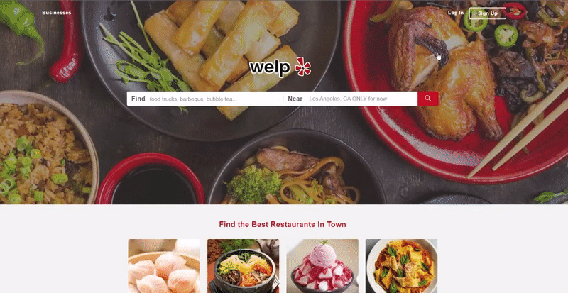
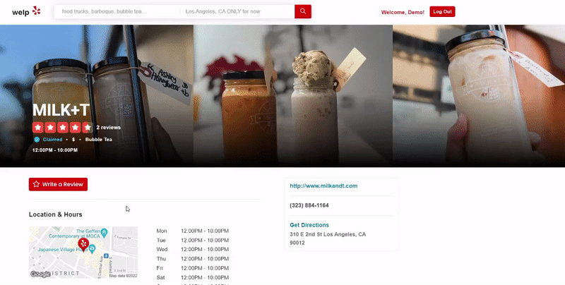

# Welcome to Welp!


[Welp](https://welp0.herokuapp.com/#/) is a fullstack clone of Yelp.com, a website that allows users to search for businesses in a specified location and leave ratings and reviews for those businesses.  
<br/>

# Technologies
#### Backend: Ruby on Rails
#### Frontend: React/Redux
#### Database: PostgreSQL
#### Third Party API: Google Maps JavsScript API
#### Image Hosting: Amazon S3
#### Design and Styling: HTML and CSS  

<br/>
# Key Features

### User Auth
- Users can signup for an account and login (or login as a demo user with the corresponding button)
- Errors are styled and do not persist

  

<br>
### Create, Edit, and Delete Reviews
- Users must be logged in to be able to create, edit, or delete reviews
- Users can see all reviews but are only able to edit and delete their own reviews
- Rating a business will accordingly affect the business' rating on the index and show pages



I wanted the picture of the star ratings to dynamically change based on the ratings for a particular business, so I created a function that returns a className string based on the business's average rating.  Then, I used CSS on each className to render the corresponding part of a star-ratings sprite sheet image I pulled from Yelp.
```js
    Object.keys(this.props.business).forEach(key => {
      if (key === "reviews") {
        Object.values(this.props.business.reviews).forEach(review => {
          avgRating += review.rating
        })
      }
    })
    let rating = (avgRating/this.props.business.reviews.length).toFixed(2)
    if (rating >= 4.75) {
      return "business-item-rating-5"
    } else if (rating >= 4.25) {
      return "business-item-rating-4-5"
    } else if (rating >= 3.75) {
      return "business-item-rating-4"
    } else if (rating >= 3.25) {
      return "business-item-rating-3-5"
    } else if (rating >= 2.75) {
      return "business-item-rating-3"
    } else if (rating >= 2.25) {
      return "business-item-rating-2-5"
    } else if (rating >= 1.75) {
      return "business-item-rating-2"
    } else if (rating >= 1.25) {
      return "business-item-rating-1-5"
    } else if (rating >= 0.75) {
      return "business-item-rating-1"
    } 
  }
 ```  

<br/>
### Business Index, Search Bar, and Map
- Users can search for businesses based on their name, category, or price
- Shows a list of businesses based on filters or a search query, if specified, with their basic information and their locations on a map


The left-side price filters initially posed a bit of a challenge as each time a new price filter was clicked, new markers to keep getting added to the map, leading to too many  markers and duplicate numbers, so I had to figure out a way to remove the previous filters' markers upon the user clicking a new filter.
```js
  updateMarkers(businesses) {
    Object.keys(this.markers).forEach(markerKey => {
      this.markers[markerKey].setMap(null)
      delete this.markers[markerKey]
    })
    
    businesses.forEach(business => {
      if (!this.markers[business.id]) {
        let index = businesses.indexOf(business) + 1
        this.createMarkerFromBusiness(business, index)
      }
    })
  }
 ```  

<br/>
# Bonus Features
- Add feature for reacting to a review ('helpful', 'funny', etc)
- Add a user show page to display all their reviews
